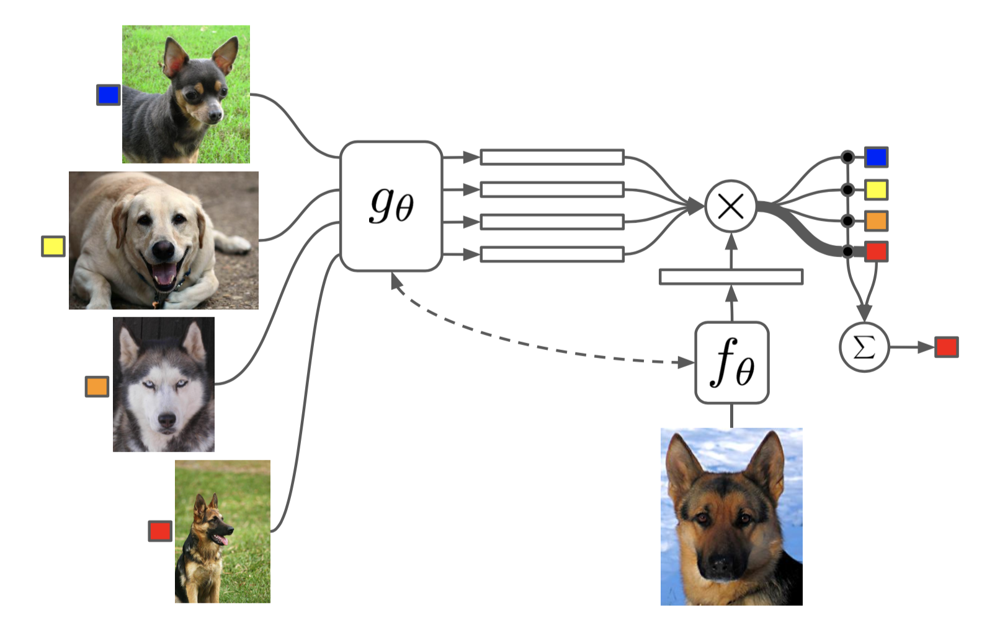

# Meta-Learning Overview

## Contents

1. Types of Meta Learning
   1. Optimization-based
      1. Meta-Gradient Reinforcement Learning
      2. Learning to learn by gradient descent by gradient descent
      3. Optimization as a model for Few-Shot Learning
   2. Metric-based
      1. Siamese neural networks for one-shot image recognition
      2. Matching networks for one shot learning
      3. Relation Networks
      4. Prototypical Networks
   3. Model-based
      1. $RL^2$: Fast reinforcement learning via slow reinforcement learning
      2. Meta Networks
   4. Model-agnostic
      1. Model-Agnostic Meta-Learning forFast Adaption of Deep Networks
      2. Reptile: On First-Order Meta Learning Algorithms

## Types of Meta-Learning

### Optimization-based

Learn an optimizer or its parameters.

#### Meta-Gradient Reinforcement Learning

 Xu, Zhongwen, Hado van Hasselt, and David Silver. **[Meta-Gradient Reinforcement Learning](https://arxiv.org/abs/1805.09801)** arXiv preprint arXiv:1805.09801 (2018).

The goal of reinforcement learning algorithms is to estimate and/or optimise the value function. However, unlike supervised learning, no teacher or oracle is available to provide the true value function. Instead, the majority of reinforcement learning algorithms estimate and/or optimise a proxy for the value function. This proxy is typically based on a sampled and bootstrapped approximation to the true value function, known as a return. The particular choice of return is one of the chief components determining the nature of the algorithm: the rate at which future rewards are discounted; when and how values should be bootstrapped; or even the nature of the rewards themselves. It is well-known that these decisions are crucial to the overall success of RL algorithms. **We discuss a gradient-based meta-learning algorithm that is able to adapt the nature of the return, online, whilst interacting and learning from the environment**. When applied to 57 games on the Atari 2600 environment over 200 million frames, our algorithm achieved a new state-of-the-art performance.

Key points:

- Gradient-based meta-learning algorithm which is able to adapt the nature of the return, online, whilst interacting and learning from environment
- Finding optimal values for $\gamma$ and $\lambda$

#### Learning to learn by gradient descent by gradient descent

Andrychowicz, Marcin, Denil, Misha, Gomez, Sergio, Hoffman, Matthew W, Pfau, David, Schaul, Tom, and de Freitas, Nando. **[Learning to learn by gradient descent by gradient descent](https://arxiv.org/abs/1606.04474)**. In Advances in Neural Information Processing Systems, pp. 3981–3989, 2016

The move from hand-designed features to learned features in machine learning has been wildly successful. In spite of this, optimization algorithms are still designed by hand. In this paper we show how the design of an optimization algorithm can be cast as a learning problem, allowing the algorithm to learn to exploit structure in the problems of interest in an automatic way. Our learned algorithms, implemented by LSTMs, outperform generic, hand-designed competitors on the tasks for which they are trained, and also generalize well to new tasks with similar structure. We demonstrate this on a number of tasks, including simple convex problems, training neural networks, and styling images with neural art.

Key points:

- In this paper they learn an optimiser like Rprop, Adagrad or ADAM by using an LSTM
- Instead of a hand designed optimiser they learn an optimizer

#### Optimization as a model for Few-Shot Learning

Sachin Ravi∗ and Hugo Larochelle. [Optimization as a model for Few-Shot Learning](https://openreview.net/pdf?id=rJY0-Kcll)

Though deep neural networks have shown great success in the large data domain, they generally perform poorly on few-shot learning tasks, where a classifier has to quickly generalize after seeing very few examples from each class. The general belief is that gradient-based optimization in high capacity classifiers requires many iterative steps over many examples to perform well. Here, we propose an **LSTM- based *meta-learner* model to learn the exact optimization algorithm used to train another *learner* neural network classifier in the few-shot regime**. The parametrization of our model allows it to learn **appropriate parameter updates specifically for the scenario** where a set amount of updates will be made, while **also learning a general initialization of the learner (classifier)** network that allows for quick convergence of training. We demonstrate that this meta-learning model is competitive with deep metric-learning techniques for few-shot learning.

key points:

* 

### Metric-based

#### Siamese neural networks for one-shot image recognition

Gregory Koch, Richard Zemel, Ruslan Salakhutdinov. **[Siamese Neural Networks for One-shot Image Recognition](https://www.cs.cmu.edu/~rsalakhu/papers/oneshot1.pdf)**. 

The process of learning good features for machine learning applications can be very computationally expensive and may prove difficult in cases where little data is available. A prototypical example of this is the *one-shot learning* setting, in which we must correctly make predictions given only a single example of each new class. In this paper, we explore a method for learning *siamese neural networks* which employ a unique structure to naturally rank similarity between inputs. Once a network has been tuned, we can then capitalize on powerful discriminative features to generalize the predictive power of the network not just to new data, but to entirely new classes from unknown distributions. Using a convolutional architecture, we are able to achieve strong results which exceed those of other deep learning models with near state-of-the-art perfor- mance on one-shot classification tasks.

Key points:

?!?!

#### Matching networks for one shot learning

Vinyals, Oriol, Blundell, Charles, Lillicrap, Tim, Wierstra, Daan, et al. **[Matching networks for one shot learning](https://arxiv.org/abs/1606.04080)**. In Advances in Neural Information Processing Systems, pp. 3630–3638, 2016.

Learning from a few examples remains a key challenge in machine learning. Despite recent advances in important domains such as vision and language, the standard supervised deep learning paradigm does not offer a satisfactory solution for learning new concepts rapidly from little data. In this work, we employ ideas from metric learning based on deep neural features and from recent advances that **augment neural networks with external memories**. Our framework learns a network that maps a small labelled support set and an unlabelled example to its label, obviating the need for fine-tuning to adapt to new class types. We then define one-shot learning problems on vision (using Omniglot, ImageNet) and language tasks. Our algorithm improves one-shot accuracy on ImageNet from 87.6% to 93.2% and from 88.0% to 93.8% on Omniglot compared to competing approaches. We also demonstrate the usefulness of the same model on language modeling by introducing a one-shot 

Key ideas:

?!?

#### Learning to Learn: Relation Networks

**Relation Network (RN)** ([Sung et al., 2018](http://openaccess.thecvf.com/content_cvpr_2018/papers_backup/Sung_Learning_to_Compare_CVPR_2018_paper.pdf)) is similar to [siamese network](https://lilianweng.github.io/lil-log/2018/11/30/meta-learning.html#convolutional-siamese-neural-network) but with a few differences:

We present a conceptually simple, flexible, and general framework for few-shot learning, where a classifier must **learn to recognise new classes given only few examples from each**. Our method, called the Relation Network (RN), is trained end-to-end from scratch. During meta-learning, it learns to learn a deep **distance metric** to compare a small number of images within episodes, each of which is designed to simulate the few-shot setting. Once trained, a RN is able to classify images of new classes by computing relation scores between query images and the few examples of each new class without further updating the network. Be- sides providing improved performance on few-shot learning, our framework is easily extended to zero-shot learning. 

Key ideas:

1. The relationship is not captured by a simple L1 distance in the feature space, but predicted by a CNN classifier.
2. The objective function is MSE loss instead of cross-entropy, because conceptually RN focuses more on predicting relation scores which is more like regression, rather than binary classification.

#### Prototypical Networks for Few-shot Learning

[Jake Snell, Kevin Swersky, Richard S. Zemel](https://arxiv.org/abs/1703.05175)

Key ideas:

- matching networks can be interpreted as weighted nearest-neighbour classifier applied within an embedding space
- *prototypical networks* is based on the idea that there exists an embedding in which points cluster around a single prototype representation for each class

### Model-based

#### $RL^2$: Fast reinforcement learning via slow reinforcement learning

Y. Duan, J. Schulman, X. Chen, P. Bartlett, I. Sutskever, and P. Abbeel. **[Rl2: Fast reinforcement learning via slow reinforcement learning](https://arxiv.org/abs/1611.02779)**. Technical report, UC Berkeley and OpenAI, 2016.

Rather than designing a "fast" reinforcement learning algorithm, we propose to represent it as a recurrent neural network (RNN) and learn it from data. In our proposed method, RL2, the algorithm is encoded in the weights of the RNN, which are learned slowly through a general-purpose ("slow") RL algorithm. The RNN receives all information a typical RL algorithm would receive, including observations, actions, rewards, and termination flags; and it retains its state across episodes in a given Markov Decision Process (MDP). The activations of the RNN store the state of the "fast" RL algorithm on the current (previously unseen) MDP. We evaluate RL2 experimentally on both small-scale and large-scale problems. On the small-scale side, we train it to solve randomly generated multi-arm bandit problems and finite MDPs. After RL2 is trained, its performance on new MDPs is close to human-designed algorithms with optimality guarantees. On the large-scale side, we test RL2 on a vision-based navigation task and show that it scales up to high-dimensional problems

#### Meta Networks

Munkhdalai T, Yu H. **[Meta Networks](https://arxiv.org/abs/1703.00837)**

In this work, we introduce a novel meta learning method, Meta Networks (MetaNet), that learns a meta-level knowledge across tasks and shifts its inductive biases via fast parameterization for rapid generalization. When evaluated on Omniglot and Mini-ImageNet benchmarks, our MetaNet models achieve a near human-level performance and outperform the baseline approaches by up to 6% accuracy. We demonstrate several appealing properties of MetaNet relating to generalization and continual learning.

Key ideas:

* Enables neural network to learn to generalise a new task or concept from a single example on the fly
* Consisting fo two main learning components:
  1. base learner - performs in the input task space
     * provides meta learner with a feedback in form of higher oder meta information to explain its own status in currecent task space
  2. Meta learner - performs in the task-agnostic meta space
     * by operating in meta space the meta learner supports continual learning and performs meta knowledge acquisition across different tasks
     * Meta learner is equipped with external memory for rapid learning and generalization
* MetaNet has two types of loss fct.:
  1. Representation loss (defined for the good representation learner criteria) and
  2. a main (task) loss for the input task objective
* Shows some properties to generalization and continual learning

### Model-agnostic

#### Model-Agnostic Meta-Learning for Fast Adaption of Deep Networks

Chelsea Finn et. al [https://arxiv.org/abs/1703.03400](Model-Agnostic Meta-Learning for Fast Adaptation of Deep Networks)

We propose an algorithm for meta-learning that is model-agnostic, in the sense that it is **compatible with any model trained with gradient descent** and applicable to a variety of different learning problems, including **classification, regression, and reinforcement learning**. The goal of meta-learning is to **train a model on a variety of learning tasks, such that it can solve new learning tasks using only a small number of training samples**. In our approach, the **parameters of the model are explicitly trained such that a small number of gradient steps with a small amount of training data from a new task will produce good generalization performance on that task**. In effect, our method trains the model to be easy to fine-tune. 

Key ideas:

* **model-agnostic** in the sense that is compatible with any model trained with **gradient descent**
* applicable of a variety of problems like classification (few-shot), regression (few-shot), reinforcement learning and architectures (fully connected, convolutional in several domains)
* fast and flexible learning is challenging because agent must integrate its prior experience with small amount of new information while avoiding overfitting to the new data
* meta-learning should be general to the task and the form of computation required to complete the task (should not rely on the task and does not need to tweak the algorithm every new problem)
* **key idea**: train models initial parameters such that only one or few gradient descent steps with small amount of data of the new task is needed to gain maximal performance
* MAML does not expand the number of learned parameters
* MAML does not place constraints on the model architecture (e. g. "only RNN")
* MAML can be used with a variety of loss functions
* **feature learning standpoint**: building an internal representation that is broadly suitable for many tasks
* **dynamical systems standpoint**: maximizing the sensitivity of the loss functions of new tasks with respect to the parameters: when the sensitivity is high, small local changes to the parameters can lead to large improvements in the task loss.

#### Reptile: On First-Order Meta Learning Algorithms

This paper considers meta-learning problems, where there is a distribution of tasks, and we would like to obtain an agent that performs well (i.e., learns quickly) when presented with a previously unseen task sampled from this distribution. We analyze a family of algorithms for learning a parameter initialization that can be fine-tuned quickly on a new task, **using only first-order derivatives** for the meta-learning updates. This family includes and generalizes first-order MAML, an approximation to MAML obtained by ignoring second-order derivatives. It also includes Reptile, a new algorithm that we introduce here, which works by **repeatedly sampling a task, training on it, and moving the initialization towards the trained weights on that task**. We expand on the results from Finn et al. showing that first-order meta-learning algorithms perform well on some well-established benchmarks for few-shot classification, and we provide theoretical analysis aimed at understanding why these algorithms work.

### Fast Context Adaptation via Meta-Learning

Zintgraf, L., Shiarlis, K., Kurin, V., Hofmann, K., Whiteson, S. (2018) **[Fast Context Adaptation via Meta-Learning](https://arxiv.org/abs/1810.03642)**

Good blog article: http://whirl.cs.ox.ac.uk/blog/cavia/

In the inner update loop, we update context parameters .

In the outer update loop, we update the global parameters .

Keeping a separate set of parameters has two advantages. First, we can vary the size of it based on the task on hand, incorporating prior knowledge about the task into the network structure. Second, it is much easier to parallelise than MAML. **So $\theta$ can be different to $\phi$ !!** 

To illustrate this, the below figure shows the number of parameters we update on the benchmarks we tested, for MAML versus CAVIA (note the log-scale on the y-axis):

This figure shows that the amount of adaptation on these benchmarks is relatively small. 

- Many interesting few-shot learning tasks require generalisation in the form of task identification, and we can use this to develop more robust algorithms.
- Current benchmarks often require only this type of generalisation. We believe that more benchmarks are necessary to push beyond this (such as the [Meta-Dataset)](https://arxiv.org/abs/1903.03096).

We believe that CAVIA opens up the possibilities for exciting new research directions, including

- More interpretable algorithms that allow an analysis of what the context parameters learn.
- The reuse of the context parameters for downstream tasks, auxiliary tasks, or distributed machine learning systems.
